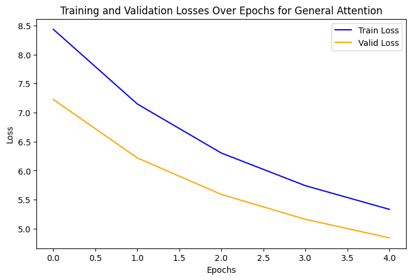
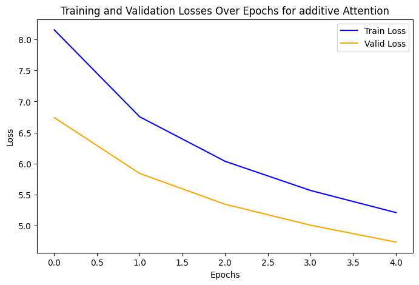
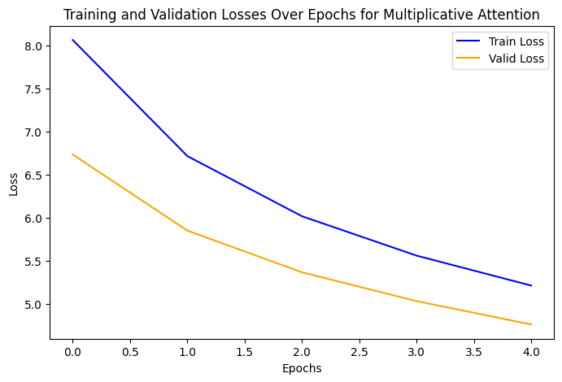
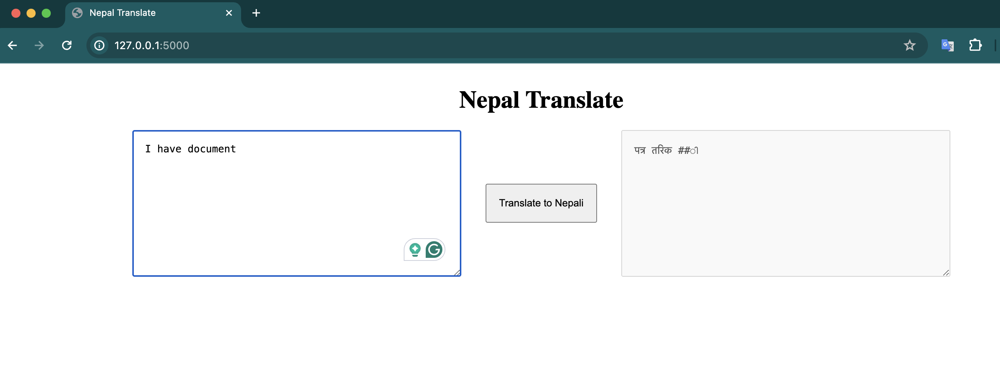

# Nepal Translate

Submitted by:

Sunil Prajapati

st124073

### Description

Nepal Translate is a web application that allows users to translate Engish to Nepali.

### Training Metrics:

| Attention Variant | Training Loss | Training PPL | Validation Loss | Validation PPL |
|-------------------|---------------|--------------|------------------|-----------------|
| General           | 6.473         | 647.577      | 5.869            |  353.903           |
| Multiplicative    | 6.140         | 464.050      | 5.595            | 269.178             |
| Additive          | 6.237         | 511.191      | 5.682            | 293.679            |

### Visualization

### Performance Analysis

| Attention Variant |  Inference Time | Model Size (MB)| 
|-------------------|------------------------|--------------|
| General           |        0.02    |  52.69        |   
| Multiplicative    |         0.041    |  52.69         |    
| Additive          |           0.060    |  52.69         | 

### Running the App

To run the app, go the app folder

`cd app`

Run the flask app using command

`python3 main.py`

### Demo

